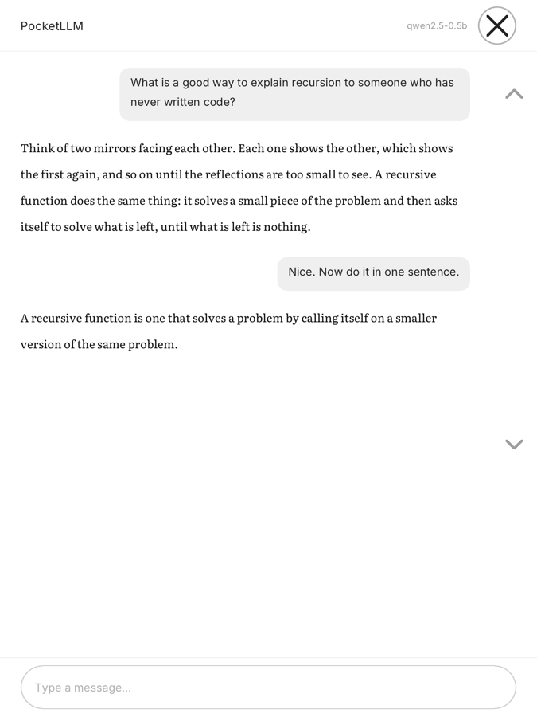

# PocketLLM

A language model that runs **on** a jailbroken Kindle. Not a client for one
somewhere else — the weights are on the device, the arithmetic happens on the
device, and it works in aeroplane mode.

Type or paste anything and it answers. No account, no API key, no wifi, no
telemetry. Nothing you write leaves the Kindle.



## Why this is unusual

The established way to get an LLM onto a Kindle is KOReader's Assistant plugin,
which makes the Kindle a thin client for OpenAI, Claude, or an Ollama server on
your desk. Its author's own words: *"requests aren't processed on the meager
hardware of my Kindle."*

That is the reasonable conclusion. This repository takes the other one.

## What you are working with

Measured on a 12th-generation Paperwhite, not read off a spec sheet:

| | |
|---|---|
| CPU | MediaTek MT8113, two Cortex-A53 cores, **32-bit kernel** |
| RAM | 512 MB, **no swap** |
| Screen | 8bpp greyscale e-ink, ~100 ms partial refresh, ~500 ms full |
| Model | Qwen2.5-0.5B at Q4_K_M — 384 MB on disk, ~470 MB resident |
| Speed | ~5 tokens/second generating, ~8 evaluating the prompt |

A reply of a hundred words takes about half a minute. That is the deal.

Two of those numbers explain most of the code:

**`load_mode = LLAMA_LOAD_MODE_NONE`.** At llama.cpp's mmap default the kernel
evicts weight pages — there is no swap for them to go to — so every generated
token re-reads the model from eMMC and the whole thing runs **sixteen times
slower**. `MemAvailable` does not move, which is how the cause was eventually
found. One line, worth more than every other tuning decision here.

**The 32-bit kernel.** Every batched-GEMM fast path in ggml is `__aarch64__`-
gated, so an armv7 build falls through to scalar C. That is why evaluating the
prompt (8 t/s) is barely faster than generating (5 t/s), when the usual ratio is
10–50×. There is no flag that fixes it; writing ARMv7 NEON kernels is real,
unclaimed upstream work.

## Build it

```sh
make deps                       # fonts, stb_truetype, llama.cpp (pinned)
sh tools/fetch-models.sh dist/pocketllm    # ~384 MB, Apache-2.0
make package                    # cross-compiles and assembles dist/pocketllm
```

Then follow [INSTALL.md](INSTALL.md).

You need `zig` (the cross-compiler — no toolchain to install), `cmake`, and
`curl`. `sh tools/fetch-models.sh --help` lists the other models and what each
one costs you in memory and coherence.

## Work on it without a Kindle

```sh
make test        # layout and transcript, under a second
make screens     # every screen as a PNG at true panel size
make ask dist/pocketllm/model.gguf "hello" "now say that in French"
```

`make screens` runs the *same drawing code* the device runs, against a memory
buffer instead of `/dev/fb0`, so what you look at here is what the panel draws.
`make ask` runs the *same conversation code* natively, so a reply takes a second
instead of the half-minute it takes on the device.

That second one matters more than it sounds. The lesson from the sibling project
was: **verify answers, not prompts.** Reading real output found three prompt bugs
in twenty minutes that no amount of reasoning about prompts had.

## How it is put together

```
app/       chat.c      the transcript; fixed pool, drops oldest turns
           screens.c   drawing and hit tests, one geometry function each
           main.c      the event loop -- the only device-only file
model/     model_llama.c   llama.cpp; model_none.c   the same API, no model
platform/  draw.c      text and shapes, shared by both backends
           kindle/     /dev/fb0 and evdev
           host/       the same interface, writing a PNG
```

The `platform/` layer is shared, essentially unchanged, with a companion
project that answers questions about the book you are reading. Both draw
through one interface with two backends, which is why either one's screens can
be reviewed as PNGs without a device.

## Some things that are true of e-ink and not of screens

- **Flash the tap.** No cursor, no haptics. An unacknowledged tap reads as
  "broken" long before it reads as "still working."
- **Never full-refresh on a tap.** It flashes the whole panel black for half a
  second. Partial refresh, always, except on a genuinely new screen.
- **Redraw at most every ~450 ms while streaming.** Per-token would spend more
  of the budget pushing pixels than generating them, and the panel cannot show
  it that fast anyway.
- **Big targets, and a scroll rail.** Swipes on an e-ink digitiser are
  unreliable enough that a target you cannot miss beats a scrollbar you can.

## Licence

MIT — see [LICENSE](LICENSE). Everything fetched rather than committed is under
its own licence; [THIRD-PARTY.md](THIRD-PARTY.md) lists each one, including a
precise note on the one Kindle-specific header.

Kindle and Amazon are trademarks of Amazon.com, Inc. This project is not
affiliated with or endorsed by Amazon. Jailbreaking your Kindle is your
decision and your risk; nothing here modifies the device's firmware.
