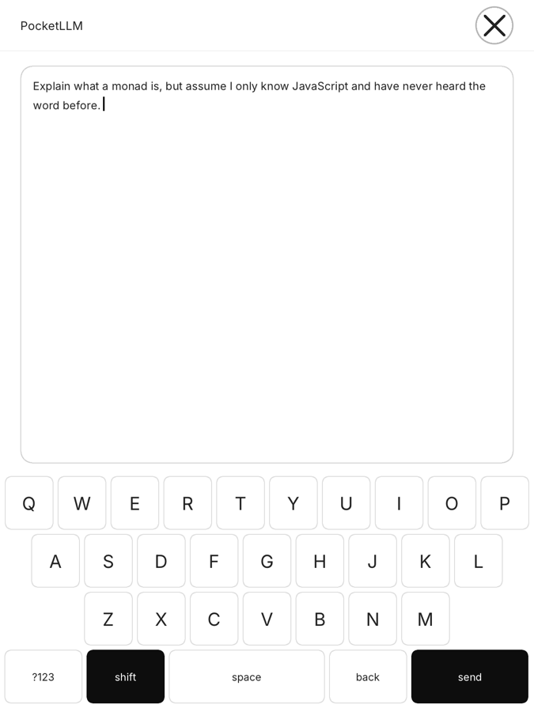
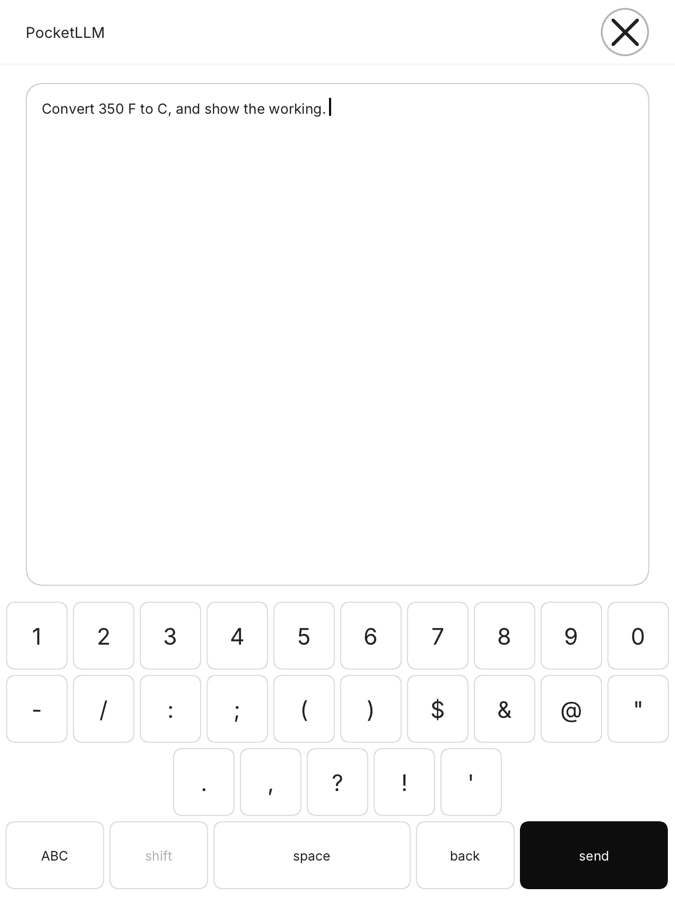
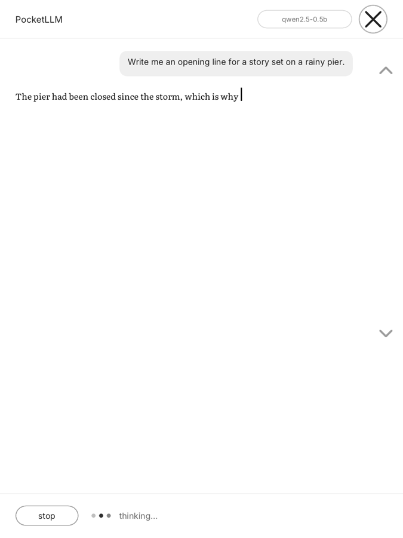
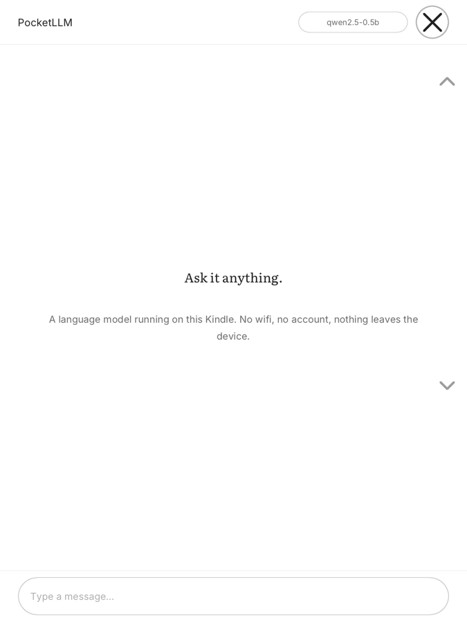

# PocketLLM

A language model that runs **on** a jailbroken Kindle. Not a client for one
somewhere else — the weights are on the device, the arithmetic happens on the
device, and it works in aeroplane mode.

Type or paste anything and it answers. No account, no API key, no wifi, no
telemetry. Nothing you write leaves the Kindle.

| | |
|:--:|:--:|
|  |  |
| A conversation. Your side in a bubble, its side set flush in a serif, like the book the device was built for. | Every model you installed, and what each one costs you in waiting. |
|  |  |
| Type or paste. Every key is checked by a test to be on-screen and hittable on three panel sizes. | Numbers and punctuation, because a chat app is not a search box. |
|  |  |
| A reply arriving. The caret tracks the last glyph; the dots walk so a still screen never reads as a crash. | Nothing to configure, nothing to sign into, nothing leaving the device. |

## Why this is unusual

The established way to get an LLM onto a Kindle is KOReader's Assistant plugin,
which makes the Kindle a thin client for OpenAI, Claude, or an Ollama server on
your desk. Its author's own words: *"requests aren't processed on the meager
hardware of my Kindle."*

That is the reasonable conclusion. This repository takes the other one.

## What you are working with

Measured on a 12th-generation Paperwhite, not read off a spec sheet:

| | |
|---|---|
| CPU | MediaTek MT8113, two Cortex-A53 cores, **32-bit kernel** |
| RAM | 1 GB total — but ~**550 MB free** with the reader running, **no swap** |
| Screen | 8bpp greyscale e-ink, ~100 ms partial refresh, ~500 ms full |
| Measured | Gemma-3-270M: **5.52 tok/s** generating, 8.64 evaluating |

A reply of a hundred words takes somewhere between ten seconds and a minute,
depending on which model you pick. That is the deal, and the app is honest
about it.

Two of those numbers explain most of the code:

**`load_mode = LLAMA_LOAD_MODE_NONE`.** At llama.cpp's mmap default the kernel
evicts weight pages — there is no swap for them to go to — so every generated
token re-reads the model from eMMC and the whole thing runs **sixteen times
slower**. `MemAvailable` does not move, which is how the cause was eventually
found. One line, worth more than every other tuning decision here.

The memory figure is why PocketLLM reads `/proc/meminfo` at startup rather than
assuming: `MemTotal` on this device is 1 GB and `MemAvailable` is 550 MB,
because the reader framework keeps running underneath. Judging a model against
the wrong one of those two numbers is the difference between a working app and
one killed mid-sentence.

**The 32-bit kernel.** Every batched-GEMM fast path in ggml is `__aarch64__`-
gated, so an armv7 build falls through to scalar C. That is why evaluating the
prompt (8 t/s) is barely faster than generating (5 t/s), when the usual ratio is
10–50×. There is no flag that fixes it; writing ARMv7 NEON kernels is real,
unclaimed upstream work.

## You pick the model

Generation here is memory-bandwidth bound: every token reads the whole model,
so **size is speed**, exactly. That makes the model choice the most
consequential thing on the device — and it is a real trade, not an obvious win
— so it gets a screen rather than a config file. Tap the model name at the top.


Each row shows what it will actually cost you. The times start as estimates
derived from the one measured point above, scaled by file size; **the first
time a model answers on your device, its real rate replaces the estimate** and
the row says `measured here`. Whether a model fits is judged against your
Kindle's own free memory, read at startup — so a device nobody has tested still
gets the right answer, and one too big is greyed out rather than crashing.

The five, all read side by side on the same three questions — an explanation, a
piece of fiction, and a fact:

| | size | a short reply | what it is like |
|---|--:|--:|---|
| **SmolLM2 135M** | 100 MB | ~8s | Quick, and readable. Gets facts right and details invented. |
| **LFM2 350M** | 219 MB | ~13s | The best writer here, and the most confidently wrong. |
| **Gemma 3 270M** | 241 MB | ~14s | Brief and obedient. Says little, but rarely rambles. |
| **SmolLM2 360M** | 258 MB | ~15s | Clear explanations. Repeats whole sentences in longer answers. |
| **Qwen2.5 0.5B** | 379 MB | ~24s | The most accurate, and the only one that stops when it is done. |

Three are Apache-2.0 and download without ceremony. LFM2 and Gemma are not
open-source licences, so the script shows you the terms and asks before it
fetches either, and ships the required notice alongside the weights.

**Not included: Qwen3-0.6B.** Same size as Qwen2.5-0.5B and a year newer, and
it is the wrong tool here — asked for the capital of Australia it spent the
entire token budget thinking out loud, concluded Sydney, and invented a 1935
riot to explain why. At five tokens a second, thinking out loud is not a
feature.

The one that loads by default is the one with the most memory headroom, not the
cleverest. A model killed for memory halfway through a reply is a worse first
experience than a slightly worse writer, and the better one is one tap away on
a screen that says plainly what it costs.

Drop any other `.gguf` into `extensions/pocketllm/models/` and it appears in the
list, sized and timed from its own bytes.

## Build it

One script. It asks which Kindle you have, checks your tools, fetches
everything, cross-compiles, and lays out a folder you copy straight onto the
device:

```sh
./build.sh
```

It asks because what fits depends on free memory, not on the model number —
1 GB devices take all five, 512 MB devices four, and a 256 MB Kindle only the
smallest. Getting the answer wrong is harmless: the app re-checks on the
device and greys out anything that will not run.

```
dist/COPY-TO-KINDLE/
    documents/shortcut_pocketllm.sh
    extensions/pocketllm/
        pocketllm              3.9 MB, static, no dependencies
        models/                the models you chose
        Literata.ttf  Inter.ttf  OFL-*.txt
```

Copy those two folders onto the Kindle's drive and open KUAL. That is the whole
installation — see [INSTALL.md](INSTALL.md).

```sh
./build.sh 1gb        # Paperwhite 12th gen and other 1 GB devices
./build.sh 512mb      # Paperwhite 11th gen, Oasis, Scribe
./build.sh 256mb      # the oldest Kindles
./build.sh smol360    # one model by name
./build.sh none       # the app alone
```

You need `zig` (the cross-compiler — there is no ARM toolchain to set up
besides it), `cmake`, `curl`, `git` and `make`. `build.sh` checks for all of
them before it downloads anything.

## Work on it without a Kindle

```sh
make test        # layout and transcript, under a second
make screens     # every screen as a PNG at true panel size
make ask && ./out/ask dist/COPY-TO-KINDLE/extensions/pocketllm/models/*0.5B*.gguf \
      "hello" "now say that in French"
```

`make screens` runs the *same drawing code* the device runs, against a memory
buffer instead of `/dev/fb0`, so what you look at here is what the panel draws.
`make ask` runs the *same conversation code* natively, so a reply takes a second
instead of the half-minute it takes on the device.

That second one matters more than it sounds. The lesson from the sibling project
was: **verify answers, not prompts.** Reading real output found three prompt bugs
in twenty minutes that no amount of reasoning about prompts had.

## How it is put together

```
app/       chat.c      the transcript; fixed pool, drops oldest turns
           models.c    what is installed, what each costs, what it really did
           screens.c   drawing and hit tests, one geometry function each
           main.c      the event loop -- the only device-only file
model/     model_llama.c   llama.cpp; model_none.c   the same API, no model
platform/  draw.c      text and shapes, shared by both backends
           kindle/     /dev/fb0 and evdev
           host/       the same interface, writing a PNG
```

The `platform/` layer is shared, essentially unchanged, with a companion
project that answers questions about the book you are reading. Both draw
through one interface with two backends, which is why either one's screens can
be reviewed as PNGs without a device.

## Some things that are true of e-ink and not of screens

- **Flash the tap.** No cursor, no haptics. An unacknowledged tap reads as
  "broken" long before it reads as "still working."
- **Never full-refresh on a tap.** It flashes the whole panel black for half a
  second. Partial refresh, always, except on a genuinely new screen.
- **Redraw at most every ~450 ms while streaming.** Per-token would spend more
  of the budget pushing pixels than generating them, and the panel cannot show
  it that fast anyway.
- **Big targets, and a scroll rail.** Swipes on an e-ink digitiser are
  unreliable enough that a target you cannot miss beats a scrollbar you can.
- **Hand the panel back clean.** The reader framework composites into
  `/dev/fb0` and does not know another program drew over it, so it will not
  repaint when yours quits — whatever you leave sits on the user's home screen
  until something forces a redraw. So: no goodbye message, a white GC16 full
  flash as the last thing the app does, and the shortcut asks the framework to
  redraw home afterwards.
- **A tap that starts something is still arriving while it runs.** Tapping
  *send* left a tap queued at the bottom of the screen; the generating screen
  put *stop* in that same place; the first poll during generation read one as
  the other and killed the reply after four tokens. What came back was the
  model's opening words, which for a small model restate the question — so it
  looked like the thing was parroting you. Three fixes: drain the queue when a
  long operation begins, ignore *stop* for the first moments, and keep the two
  buttons at opposite ends of the screen. A test holds the last one.

## Licence

MIT — see [LICENSE](LICENSE). Everything fetched rather than committed is under
its own licence; [THIRD-PARTY.md](THIRD-PARTY.md) lists each one, including a
precise note on the one Kindle-specific header.

Kindle and Amazon are trademarks of Amazon.com, Inc. This project is not
affiliated with or endorsed by Amazon. Jailbreaking your Kindle is your
decision and your risk; nothing here modifies the device's firmware.
